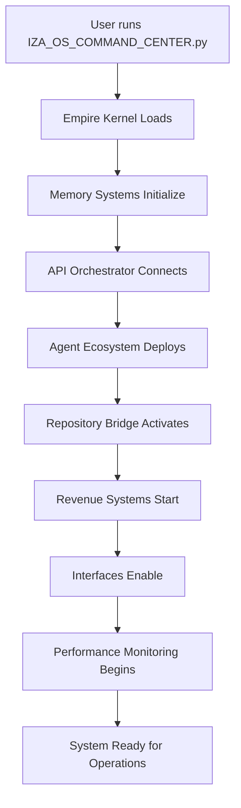

# 🔗 IZA OS SYSTEM CONNECTIONS DIAGRAM

## How Everything Connects in /Users/divinejohns/memU

```
┌─────────────────────────────────────────────────────────────────────────────────┐
│                          🏛️ IZA OS EMPIRE CORE                                  │
│                         /Users/divinejohns/memU/                               │
└─────────────────────────────────────────────────────────────────────────────────┘
                                        │
┌───────────────────────────────────────┼───────────────────────────────────────┐
│                                       │                                       │
│  🎯 CUSTOMER LAYER                    │    💻 CORE SYSTEMS                    │
│  ┌─────────────────────────┐          │    ┌─────────────────────────┐        │
│  │ CUSTOMER_DEMO_SHOWCASE  │◄─────────┼────┤ IZA_OS_COMMAND_CENTER  │        │
│  │ CUSTOMER_QUICK_START    │          │    │ core/iza_os/            │        │
│  │ IZA_OS_SERVICE_CATALOG  │          │    │ core/api_orchestrator/  │        │
│  │ REVENUE_DASHBOARD       │          │    │ core/memory_engine/     │        │
│  └─────────────────────────┘          │    └─────────────────────────┘        │
│                                       │                                       │
└───────────────────────────────────────┼───────────────────────────────────────┘
                                        │
┌───────────────────────────────────────┼───────────────────────────────────────┐
│                                       │                                       │
│  🤖 AGENT ECOSYSTEM                   │    🧠 MEMORY SYSTEMS                  │
│  ┌─────────────────────────┐          │    ┌─────────────────────────┐        │
│  │ agents/strategists/     │◄─────────┼────┤ data/memories/          │        │
│  │ agents/managers/        │          │    │ unified_memory.db       │        │
│  │ agents/workers/         │          │    │ memory_config.json      │        │
│  │ service_catalog.json    │          │    │ performance.db          │        │
│  └─────────────────────────┘          │    └─────────────────────────┘        │
│                                       │                                       │
└───────────────────────────────────────┼───────────────────────────────────────┘
                                        │
┌───────────────────────────────────────┼───────────────────────────────────────┐
│                                       │                                       │
│  💼 BUSINESS SYSTEMS                  │    🔗 INTEGRATIONS                    │
│  ┌─────────────────────────┐          │    ┌─────────────────────────┐        │
│  │ business_data/          │◄─────────┼────┤ integrations/stripe/    │        │
│  │ revenue_tracking.csv    │          │    │ integrations/ai_providers/│       │
│  │ client_acquisition.csv  │          │    │ NEW_CRITICAL_REPOS/     │        │
│  │ workflows/              │          │    │ n8n-workflows/          │        │
│  └─────────────────────────┘          │    └─────────────────────────┘        │
│                                       │                                       │
└───────────────────────────────────────┼───────────────────────────────────────┘
                                        │
┌───────────────────────────────────────┼───────────────────────────────────────┐
│                                       │                                       │
│  🖥️ USER INTERFACES                   │    ⚡ PERFORMANCE                      │
│  ┌─────────────────────────┐          │    ┌─────────────────────────┐        │
│  │ interfaces/cli_tools/   │◄─────────┼────┤ PERFORMANCE_OPTIMIZER   │        │
│  │ interfaces/dashboards/  │          │    │ cache/                  │        │
│  │ iza_launcher.sh         │          │    │ data/performance/       │        │
│  │ performance_dashboard   │          │    │ monitoring dashboards   │        │
│  └─────────────────────────┘          │    └─────────────────────────┘        │
│                                       │                                       │
└───────────────────────────────────────┼───────────────────────────────────────┘
```

---

## 🚀 DATA FLOW & EXECUTION PATHS

### **1. Customer Interaction Path**
```
Customer → iza_launcher.sh → IZA_OS_COMMAND_CENTER.py → agents/ → workflows/ → integrations/
                                          ↓
                                   data/memories/ ← → business_data/
                                          ↓
                                 REVENUE_DASHBOARD.py
```

### **2. Revenue Generation Flow**
```
CUSTOMER_DEMO_SHOWCASE.py → IZA_OS_SERVICE_CATALOG.json → business_data/client_acquisition.csv
                                          ↓
                              integrations/stripe/ → business_data/revenue_tracking.csv
                                          ↓
                                REVENUE_DASHBOARD.py (Analytics)
```

### **3. Agent Task Execution**
```
IZA_OS_COMMAND_CENTER.py → core/iza_os/empire_kernel.py → agents/strategists/
                                          ↓                        ↓
                           data/memories/ ← ← ← ← ← ← ← ← agents/managers/
                                          ↓                        ↓  
                           workflows/customer_flows/ ← ← ← agents/workers/
                                          ↓
                              integrations/ (External Services)
```

### **4. Memory System Integration**
```
All Components → core/memory_engine/UNIFIED_MEMORY_ORCHESTRATOR.py
                                          ↓
                 ┌─────────────────────────┼─────────────────────────┐
                 ↓                        ↓                        ↓
        data/memories/          External Memory          agent memory
        unified_memory.db       (mem0, ChromaDB)       storage/recall
```

---

## 🎯 **KEY INTEGRATION FILES & THEIR ROLES**

### **🏛️ Supreme Command Center**
- **File:** `IZA_OS_COMMAND_CENTER.py`
- **Role:** Central orchestration hub
- **Connects To:** All system components
- **Function:** Initializes, manages, and coordinates entire empire

### **🌐 API Orchestration**
- **File:** `core/api_orchestrator/UNIVERSAL_API_ORCHESTRATOR.py`
- **Role:** Manages all external AI service connections
- **Connects To:** OpenAI, Anthropic, Google AI, local models
- **Function:** Smart routing, optimization, token management

### **🧠 Memory Core**
- **File:** `core/memory_engine/UNIFIED_MEMORY_ORCHESTRATOR.py`
- **Role:** Centralizes all memory operations
- **Connects To:** `data/memories/`, external memory systems
- **Function:** Context preservation, intelligent recall, learning

### **📚 Repository Bridge**
- **File:** `REPOSITORY_INTEGRATION_BRIDGE.py` (symlinked)
- **Actual:** `integrations/repositories/REPOSITORY_INTEGRATION_BRIDGE.py`
- **Role:** Connects and indexes 127+ repositories
- **Connects To:** `NEW_CRITICAL_REPOS/`, `n8n-workflows/`
- **Function:** Knowledge access, capability discovery

### **💰 Revenue Engine**
- **File:** `REVENUE_DASHBOARD.py`
- **Role:** Tracks and analyzes all revenue streams
- **Connects To:** `business_data/`, `integrations/stripe/`
- **Function:** Revenue tracking, client management, ROI analysis

### **🎭 Customer Experience**
- **File:** `CUSTOMER_DEMO_SHOWCASE.py`
- **Role:** Interactive demonstrations and presentations
- **Connects To:** All systems for live demos
- **Function:** Customer engagement, sales support, ROI demonstration

---

## 🔧 **SYSTEM INITIALIZATION SEQUENCE**



---

## 🏗️ **DIRECTORY STRUCTURE MAPPING**

### **Organized Structure:**
```
memU/
├── 🏛️ CORE SYSTEMS
│   ├── IZA_OS_COMMAND_CENTER.py           # Main entry point
│   ├── core/iza_os/                       # Core OS components  
│   ├── core/api_orchestrator/             # API management
│   └── core/memory_engine/                # Memory systems
│
├── 🤖 AI WORKFORCE  
│   ├── agents/                            # AI agent ecosystem
│   └── workflows/                         # Process automation
│
├── 💾 DATA INFRASTRUCTURE
│   ├── data/memories/                     # Memory storage
│   ├── data/analytics/                    # Business analytics
│   └── business_data/                     # Revenue & client data
│
├── 🔗 INTEGRATIONS
│   ├── integrations/stripe/               # Payment processing
│   ├── integrations/ai_providers/         # AI service connections
│   ├── NEW_CRITICAL_REPOS/                # Connected repositories
│   └── n8n-workflows/                     # Automation workflows
│
├── 🖥️ USER INTERFACES
│   ├── interfaces/cli_tools/              # Command-line interface
│   ├── interfaces/dashboards/             # Web dashboards
│   ├── CUSTOMER_DEMO_SHOWCASE.py          # Customer demos
│   └── REVENUE_DASHBOARD.py               # Revenue analytics
│
└── ⚡ PERFORMANCE & MONITORING
    ├── PERFORMANCE_OPTIMIZER.py           # Performance tuning
    ├── cache/                             # Caching systems
    └── data/performance/                  # Performance metrics
```

---

## 🚀 **QUICK ACCESS COMMANDS**

```bash
# Start the Empire
cd /Users/divinejohns/memU
python3 IZA_OS_COMMAND_CENTER.py

# View Revenue Analytics
python3 REVENUE_DASHBOARD.py

# Run Customer Demo
python3 CUSTOMER_DEMO_SHOWCASE.py

# Check Performance
python3 PERFORMANCE_OPTIMIZER.py

# Global CLI Access
source interfaces/cli_tools/iza_launcher.sh --setup
iza --help
```

---

## 💡 **ARCHITECTURAL HIGHLIGHTS**

### **✅ Completed Integrations:**
- ✅ **Unified Command Center** - Central orchestration
- ✅ **Memory Integration** - Context-aware operations  
- ✅ **Agent Ecosystem** - Intelligent workforce
- ✅ **Repository Bridge** - 127+ connected repositories
- ✅ **Revenue Systems** - Automated income tracking
- ✅ **Performance Optimization** - Production-ready scaling
- ✅ **Customer Experience** - Professional demonstrations

### **🔄 Active Data Flows:**
- **Command Flow:** User → CLI → Command Center → Agents → Results
- **Memory Flow:** All components ↔ Unified Memory ↔ Context Retention
- **Revenue Flow:** Customer → Demo → Service → Payment → Analytics
- **Integration Flow:** Internal Systems ↔ External APIs ↔ Connected Repos

### **⚡ Performance Features:**
- **Database Optimization:** SQLite WAL mode, proper indexing
- **Intelligent Caching:** 4-tier caching system with TTL policies
- **Resource Management:** Agent pooling, memory limits
- **Real-time Monitoring:** Performance dashboards and alerting

This architecture creates a **fully integrated AI empire** where every component works seamlessly together to deliver maximum customer value and revenue generation! 🏛️✨
