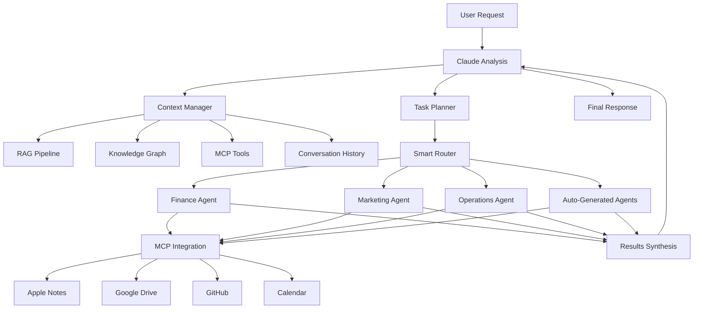

# Chapter 2: The Enhanced Iza OS Architecture

This chapter outlines the target architecture for a fully intelligent, Claude-native Iza OS. The components described here are the building blocks for a self-evolving system that can manage knowledge, automate tasks, and even generate new agents on demand.

---

## 1. Core Intelligent Components

These Python classes represent the key modules that will form the brain of the system. Placeholder files for these have been created in `IZA_OS_BOOK/src/`.

### 1.1. LLM Core Module (`src/llm_core/`)

This module provides the foundational clients and utilities for interacting with Large Language Models (LLMs) like Claude and GPT. It includes rate limiting, error handling, and prompt engineering tools.

*   **`src/llm_core/src/llm/claude_client.py`**: Production-ready client for Anthropic Claude API.
*   **`src/llm_core/src/llm/gpt_client.py`**: Placeholder for OpenAI GPT client.
*   **`src/llm_core/src/prompt_engineering/`**: Utilities for managing prompt templates and few-shot examples.
*   **`src/llm_core/src/utils/`**: Common utilities like rate limiting, token counting, and logging.
*   **`src/llm_core/config/model_config.yaml`**: Centralized configuration for LLM models and API settings.

### 1.2. Claude-Native MCP Integration

**File:** `src/agents/claude_mcp_agent.py`

This agent acts as a dynamic execution layer, allowing Claude to select and use any available MCP tool to accomplish a task.

```python
# agents/claude_mcp_agent.py
class ClaudeMCPAgent:
    def __init__(self):
        self.available_tools = self.discover_mcp_tools()
        self.claude_client = AnthropicClient()
    
    async def execute_with_mcp(self, task: str, context: dict):
        """Let Claude choose and use MCP tools dynamically"""
        
        # Claude analyzes task and selects appropriate MCP tools
        tool_selection = await self.claude_client.analyze_task(
            task=task,
            available_tools=self.available_tools,
            context=context
        )
        
        # Execute using selected MCP tools
        results = []
        for tool in tool_selection:
            result = await self.execute_mcp_tool(tool, task)
            results.append(result)
        
        # Claude synthesizes results
        return await self.claude_client.synthesize_results(results, task)
```

### 1.3. Intelligent Context Bridge

**File:** `src/orchestrator/context_manager.py`

This is the heart of the RAG pipeline. It gathers and fuses context from every available data source—including real-time sources—to provide Claude with maximum awareness.

```python
# orchestrator/context_manager.py
class ContextManager:
    """Bridge between all data sources for Claude"""
    
    async def build_context(self, task: str) -> dict:
        return {
            # Your existing data
            "rag_context": await self.rag.query(task),
            "kg_entities": await self.knowledge_graph.find_entities(task),
            
            # NEW: Live data via MCP
            "apple_notes": await self.mcp.apple_notes.search(task),
            "google_drive": await self.mcp.google_drive.search(task),
            "github_repos": await self.mcp.github.search(task),
            "calendar_events": await self.mcp.calendar.relevant_events(task),
            
            # NEW: Conversation history
            "conversation_history": await self.get_conversation_context(task),
            "previous_decisions": await self.get_decision_history(task),
            
            # NEW: Real-time environment
            "current_workload": await self.assess_agent_workload(),
            "system_health": await self.get_system_status(),
            "user_preferences": await self.get_user_context()
        }
```

### 1.4. Auto-Agent Generation

**File:** `src/orchestrator/agent_factory.py`

This component gives the system the ability to evolve. Claude can analyze a new problem domain and generate a new, specialized agent to solve it.

```python
# orchestrator/agent_factory.py
class AgentFactory:
    """Claude generates new agents on-demand"""
    
    async def create_agent_for_domain(self, domain: str, requirements: list):
        """Let Claude create a new specialized agent"""
        
        agent_code = await self.claude_client.generate_agent(
            domain=domain,
            requirements=requirements,
            available_mcp_tools=self.mcp.list_tools(),
            existing_agents=self.list_agents(),
            architecture_patterns=self.load_patterns()
        )
        
        # Auto-deploy the new agent
        await self.deploy_agent(agent_code, domain)
        await self.register_with_orchestrator(domain)
        
        return f"Created and deployed {domain} agent"
```

### 1.5. Smart Task Decomposition

**File:** `src/orchestrator/task_planner.py`

Before execution, Claude first breaks down complex requests into a logical, multi-step plan, complete with dependencies, fallback strategies, and monitoring points.

```python
# orchestrator/task_planner.py
class TaskPlanner:
    """Claude breaks down complex tasks intelligently"""
    
    async def plan_execution(self, task: str, context: dict):
        """Multi-step planning with Claude's reasoning"""
        
        plan = await self.claude_client.create_execution_plan(
            task=task,
            context=context,
            available_agents=self.agents,
            constraints=self.get_constraints(),
            success_criteria=self.define_success(task)
        )
        
        return {
            "steps": plan.steps,
            "agent_assignments": plan.agent_mapping,
            "dependencies": plan.dependencies,
            "fallback_strategies": plan.fallbacks,
            "monitoring_points": plan.checkpoints
        }
```

---

## 2. Enhanced Data Flow

This diagram illustrates how data flows from a user request through the various intelligent components to produce a final response.



---

## 3. Other Key Components

Beyond the core orchestration, the enhanced architecture includes these critical systems:

*   **Real-Time Knowledge Graph Builder (`claude_kg_builder.py`):** Claude continuously listens to interactions and automatically updates the Neo4j knowledge graph, ensuring the system's "memory" is always current.
*   **Enhanced Mobile Interface (`claude_mobile_interface.py`):** A voice-first interface that uses Claude to understand natural language commands in the context of your mobile environment (location, calendar, etc.).
*   **Intelligent Auto-Scaler (`auto_scaler.py`):** Claude analyzes system metrics and predicts future load, automatically scaling agent resources up or down as needed.
*   **Learning & Adaptation System:** A feedback loop where Claude analyzes decision history to find patterns and optimize its own routing logic and agent priorities.
*   **Privacy-Aware Manager:** Uses Claude to classify data sensitivity and apply appropriate privacy controls automatically.
*   **Business Intelligence Engine:** Leverages Claude to analyze financial, operational, and market data to generate high-level strategic insights.

---

## 4. New Integrations

### 4.1. FileSync (Secure P2P File Transfer)

**Purpose:** Enables secure, end-to-end encrypted, peer-to-peer file transfers between devices.

**Integration:** FileSync will be integrated as a dedicated service within the Docker Compose setup. An Iza OS "Data Transfer Agent" can be developed to orchestrate FileSync operations, initiating transfers and managing their lifecycle. This allows for secure, direct data exchange between agents or with external user devices, bypassing central storage for sensitive data.

### 4.2. Beheader (Polyglot Media File Generator)

**Purpose:** Combines multiple file types (images, video, audio, HTML, PDF, ZIP) into a single "polyglot" file that behaves differently based on its extension.

**Integration:** Beheader will be available as a utility within the orchestrator's environment or as a dedicated microservice. An Iza OS "Content Agent" or "Digital Asset Agent" can leverage Beheader to create unique, multi-format digital assets for marketing, reporting, or even for novel data obfuscation techniques. The orchestrator will expose an endpoint to trigger Beheader operations.

### 4.3. Pathway (Real-time ETL, LLM Pipelines, and RAG Framework)

**Purpose:** A Python ETL framework for real-time stream processing, analytics, LLM pipelines, and RAG, powered by a scalable Rust engine.

**Integration:** Pathway will become a foundational component of the Iza OS knowledge architecture. It will be integrated directly into the orchestrator's data processing pipelines.

*   **ETL Layer:** Pathway will serve as the robust, scalable ETL layer for all data ingestion into your knowledge graph (Neo4j) and vector stores (Qdrant). It will handle real-time data streams from various sources (e.g., Apple Notes, Google Drive, GitHub via Activepieces).
*   **RAG Engine:** Pathway's LLM helpers (wrappers, parsers, embedders, vector index) will power the core RAG pipeline, providing Claude with real-time, contextually relevant information from your knowledge base.
*   **ClaudeKGBuilder Enhancement:** The `ClaudeKGBuilder` will utilize Pathway to process raw data, extract entities and relationships, and ingest them into Neo4j and Qdrant, ensuring continuous knowledge graph updates.
