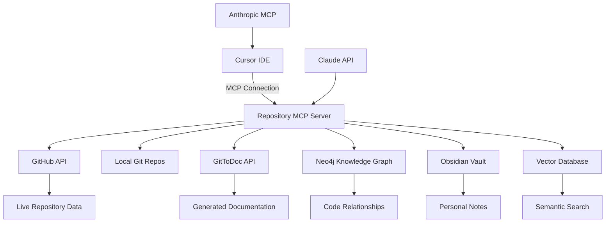

# 🌟 Repository MCP Server Integration

## 🏗️ Architecture Overview

The Repository MCP Server provides a unified interface for managing GitHub repositories, local Git repos, GitToDoc documentation, and knowledge graphs. It integrates seamlessly with Cursor IDE and Claude AI for enhanced development workflows.



## 🚀 Quick Start

### 1. **Setup Environment**
```bash
# Navigate to IZA OS production
cd iza-os-production

# Run setup script
./setup_mcp.sh

# Edit environment variables
cp env.mcp.example .env
# Add your API keys to .env
```

### 2. **Start Services**
```bash
# Start supporting services (Neo4j, Qdrant)
docker-compose -f deploy/docker/docker-compose.mcp.yml up -d

# Start MCP server
python src/integrations/repository_mcp_server.py
```

### 3. **Connect Cursor**
```bash
# Setup Cursor integration
python scripts/cursor_integration.py

# Restart Cursor IDE
```

## 📋 Configuration

### **Environment Variables**
```bash
# Required
GITHUB_TOKEN=ghp_your_token_here
OPENAI_API_KEY=sk-your-key-here

# Optional
GITTODOC_API_KEY=your_gittodoc_key
NEO4J_PASSWORD=your_neo4j_password
ANTHROPIC_API_KEY=sk-ant-your-key
```

### **MCP Configuration** (`mcp_config.yaml`)
```yaml
# GitHub Integration
github_token: ${GITHUB_TOKEN}
github_username: "divinejohns"

# Local Repository Settings
local_repos_path: "~/repositories"
auto_clone: true

# Sync Settings
sync_settings:
  auto_clone: true
  auto_gittodoc: false
  exclude_patterns:
    - ".git"
    - "node_modules"
    - "__pycache__"
```

## 🎯 **MCP Server Capabilities**

### **Repository Management**
- `list_repositories()` - Get all repos (GitHub + local)
- `sync_repository(name)` - Clone/pull + GitToDoc sync
- `analyze_repository(name)` - Deep analysis with AI insights

### **Code Intelligence**
- `search_code(query)` - Cross-repository code search
- `get_repository_insights(name)` - AI-powered analysis
- `find_related_repos(name)` - Similarity matching

### **Documentation**
- `create_gittodoc_project(name)` - Auto-generate docs
- `update_obsidian_notes(name)` - Create Obsidian notes
- `generate_readme_suggestions(name)` - AI README improvements

### **Knowledge Graph**
- `build_dependency_graph()` - Map code dependencies
- `find_code_patterns()` - Identify architectural patterns
- `suggest_refactoring()` - AI-powered improvements

## 🔍 **Usage Examples**

### **In Cursor with Claude**

#### Repository Discovery
```
@repository-server list all Python repositories with FastAPI, 
sort by stars, show recent commits
```

#### Code Analysis
```
@repository-server analyze the dependency structure of my 
'ecommerce-api' project, suggest improvements
```

#### Cross-Repository Search
```
@repository-server find common patterns across my React 
projects, suggest a shared component library
```

#### Documentation Generation
```
@repository-server generate comprehensive README for 
'ml-pipeline' repository, include installation and usage
```

### **Python API Usage**
```python
from src.integrations.repository_mcp_server import RepositoryMCPServer

# Initialize server
server = RepositoryMCPServer()

# List repositories
repos = await server.list_repositories("divinejohns")

# Analyze specific repository
analysis = await server.analyze_repository("my-project")

# Search code across all repos
results = await server.search_code("authentication", language_filter="python")

# Get AI insights
insights = await server.get_repository_insights("my-project")
```

## 🛠️ **Advanced Features**

### **Automated Documentation**
```python
# Sync all repos to GitToDoc
for repo in repositories:
    if repo.stars > 5:  # Only document popular repos
        await server.create_gittodoc_project(repo.name)
```

### **Knowledge Graph Integration**
```python
# Build dependency graph
deps = await server.build_dependency_graph()

# Find architectural patterns
patterns = await server.find_code_patterns()
```

### **Obsidian Integration**
```python
# Auto-create Obsidian notes
await server.update_obsidian_notes("my-project")
```

## 📊 **Monitoring & Health Checks**

### **Service Status**
```bash
# Check MCP server health
curl localhost:8000/health

# Verify Neo4j connection
python scripts/init_neo4j.py

# Check GitToDoc sync status
curl localhost:8000/gittodoc/status
```

### **Performance Metrics**
- Repository sync time
- Code analysis accuracy
- Documentation generation speed
- Knowledge graph update frequency

## 🔧 **Troubleshooting**

### **Common Issues**

1. **MCP Server Not Connecting**
   - Check Cursor settings.json
   - Verify Python environment
   - Check firewall/ports

2. **GitHub API Rate Limits**
   - Use GitHub App instead of PAT
   - Implement intelligent caching
   - Distribute requests over time

3. **GitToDoc Sync Failures**
   - Verify API key permissions
   - Check repository visibility
   - Review GitToDoc logs

### **Debug Commands**
```bash
# Enable debug logging
export MCP_LOG_LEVEL=DEBUG

# Test individual components
python -m pytest tests/ -v

# Manual API testing
curl -X GET localhost:8000/repositories
```

## 🚦 **Integration with IZA OS**

### **Company Integration**
The MCP server integrates with your existing companies:

- **ResumeAI**: Repository analysis for resume optimization
- **SocialFlow**: Content generation from repository patterns
- **APIConnect**: API documentation and testing

### **Autonomous Operations**
- Auto-sync repositories on schedule
- Generate documentation automatically
- Update knowledge graphs in real-time
- Create Obsidian notes for new repos

## 💡 **Pro Tips**

- **Use Repository Templates**: Standardize new projects
- **Automate Everything**: Let MCP server handle routine tasks  
- **Regular Syncs**: Schedule daily/weekly full syncs
- **Monitor Usage**: Track which repositories get most attention
- **Iterate**: Continuously improve based on usage patterns

## 🔗 **Related Documentation**

- [IZA OS Main README](../README.md)
- [Company Breakdown Strategy](../../COMPANY_BREAKDOWN_STRATEGY.md)
- [Autonomous Integration Strategy](../../AUTONOMOUS_INTEGRATION_STRATEGY.md)
- [AI Optimization Assessment](../../AI_OPTIMIZATION_ASSESSMENT.md)

---

This MCP server provides a **unified, AI-powered development environment** where Claude has complete visibility into all your code, documentation is always up-to-date, and your knowledge graph grows automatically as you work.

The modular architecture ensures everything stays extensible - you can easily add new integrations, swap components, or scale to team usage.
