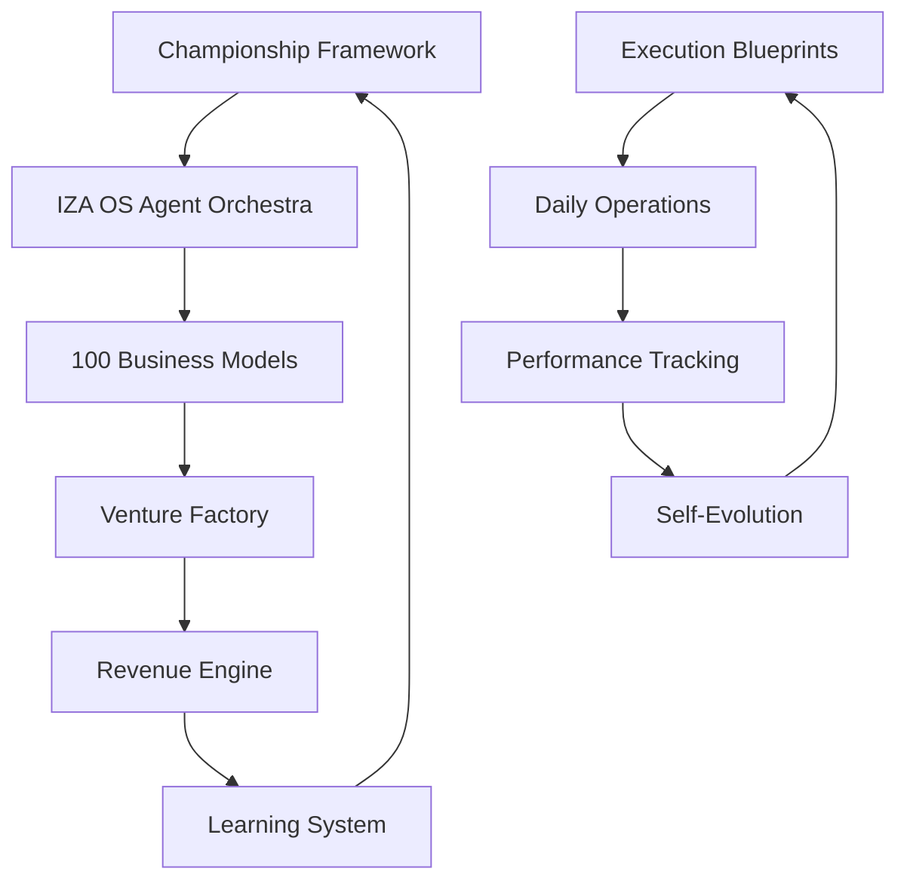

# Strategic Execution System - IZA OS Integration

## Overview

This knowledge base integrates the **Championship Framework** and **24-Month Execution Blueprint** directly into IZA OS's autonomous business creation and revenue generation capabilities.

## Integration Architecture



## Strategic Components

### 1. Championship Framework → IZA OS Integration
- **Off-season preparation** = IZA OS continuous background processing
- **Systematic execution** = Agent Orchestra coordinated workflows  
- **Performance optimization** = Revenue Engine automated improvements
- **Championship readiness** = Multi-venture portfolio management

### 2. Execution Blueprint → Business Model Deployment
- **Phase 1 (Months 1-3)**: Foundation via Tier 1 Ultra High ROI models
- **Phase 2 (Months 4-9)**: Scaling via Agent-powered automation
- **Phase 3 (Months 10-24)**: Wealth building via portfolio optimization

### 3. Operating Matrix → Agent Specialization
- **Thinking Frameworks** → Venture Creator Agent intelligence
- **Decision Making** → System Optimizer automated choices
- **Execution Style** → Repository Manager deployment patterns
- **Learning Integration** → Market Analyst continuous improvement

## File Structure

```
strategic-execution/
├── championship-framework/
│   ├── mindset-principles.md
│   ├── systematic-preparation.md
│   └── performance-optimization.md
├── execution-blueprints/
│   ├── phase-1-foundation.md
│   ├── phase-2-scaling.md
│   └── phase-3-wealth-building.md
├── operating-matrices/
│   ├── human-operating-system.md
│   └── decision-frameworks.md
├── multi-path-strategies/
│   ├── content-engine.md
│   ├── consulting-practice.md
│   ├── platform-development.md
│   └── investment-strategy.md
├── implementation-tools/
│   ├── weekly-operating-rhythm.md
│   ├── progress-tracking-templates.md
│   └── resource-allocation-frameworks.md
└── progress-tracking/
    ├── success-metrics.md
    └── decision-gates.md
```

## IZA OS Command Integration

### Strategic Planning Commands
```bash
# Initialize strategic execution system
iza strategy init --framework championship

# Set 24-month execution timeline
iza strategy timeline --months 24 --phases 3

# Deploy multi-path business models
iza strategy deploy --paths content,consulting,platform,investment

# Track championship preparation progress
iza strategy status --championship-readiness
```

### Daily Operating Rhythm
```bash
# Morning strategic brief (2 minutes)
iza strategy brief --daily

# Systematic execution check
iza strategy execute --systematic

# Performance optimization cycle
iza strategy optimize --continuous

# Evening championship review
iza strategy review --preparation-status
```

## Business Model Alignment

### Phase 1: Foundation (Business Models BM001-BM010)
- **Content Engine**: BM009 (AI Newsletter & Content Curation)
- **Consulting**: BM003 (API Integration Services) 
- **Platform**: BM001 (AI Resume Builder)
- **Investment**: Revenue from initial models funds growth

### Phase 2: Scaling (Business Models BM011-BM050)
- **Multi-client automation**: BM002 (Social Media Management)
- **Advanced platform features**: BM005 (Web Automation Suite)
- **Knowledge productization**: BM004 (AI Course Generator)
- **Portfolio diversification**: Multiple revenue streams

### Phase 3: Wealth Building (Business Models BM051-BM100)
- **Enterprise solutions**: High-value B2B offerings
- **Strategic acquisitions**: Using IZA OS venture capital
- **Platform scaling**: IPO-track growth metrics
- **Legacy building**: Industry infrastructure creation

## Success Metrics Integration

### IZA OS Dashboard Metrics
- **Championship Readiness Score**: 0-100 based on systematic preparation
- **Multi-Path Progress**: Content/Consulting/Platform/Investment tracking
- **Revenue Compound Rate**: Monthly growth across all streams
- **Systematic Execution Rate**: Automation vs manual tasks ratio

### Decision Gates
- **Month 6**: Evaluate path traction, optimize resource allocation
- **Month 12**: Platform vs consulting scalability decision
- **Month 24**: Wealth-building trajectory assessment, exit options

## Agent Orchestration for Strategic Execution

### Specialized Strategic Agents
1. **Championship Preparation Agent**: Monitors systematic readiness
2. **Multi-Path Coordination Agent**: Balances resource allocation  
3. **Performance Optimization Agent**: Continuous improvement cycles
4. **Strategic Decision Agent**: Evaluates gates and pivots

### Memory Integration
- **Context Preservation**: All strategic decisions stored in Memory Core
- **Pattern Learning**: System learns from execution patterns
- **Goal Alignment**: Continuous calibration with wealth-building targets
- **Self-Evolution**: Strategic frameworks improve based on results

## Next Steps

1. ✅ **Framework Integration**: Connect championship principles with IZA OS
2. 🔄 **Agent Specialization**: Deploy strategic execution agents  
3. 📊 **Metrics Dashboard**: Build championship readiness tracking
4. 🚀 **Deployment Pipeline**: Launch Phase 1 business models
5. 📈 **Optimization Cycles**: Implement continuous improvement
6. 🎯 **Decision Gates**: Set up automated evaluation checkpoints

This integration transforms your strategic thinking into IZA OS's autonomous execution capability, creating a systematic approach to building wealth through AI-powered business creation.
