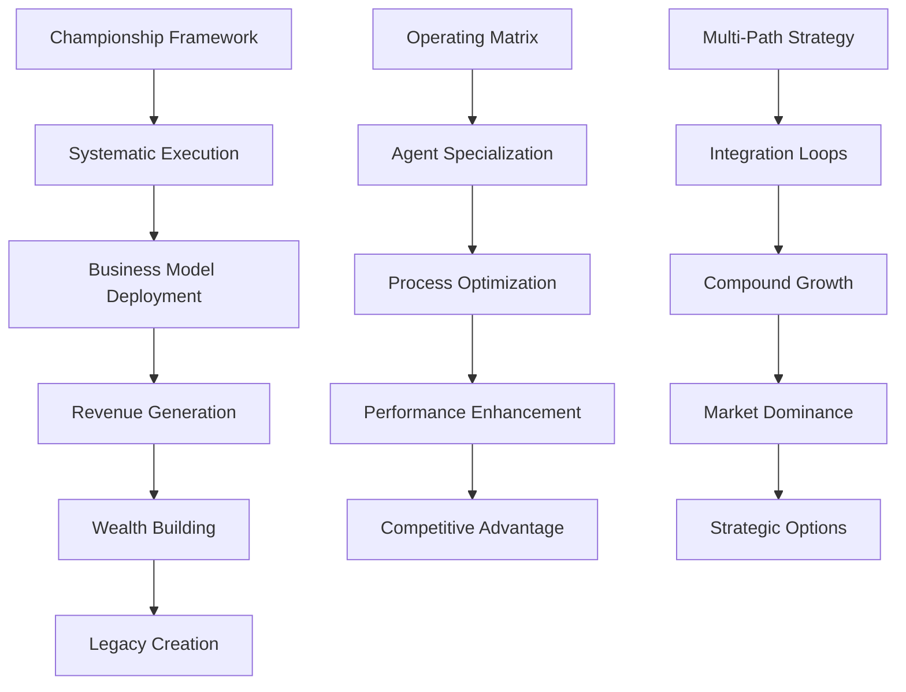

# Strategic Integration Index - IZA OS

## Overview
This index connects all strategic frameworks with IZA OS business models, agent systems, and automation capabilities for systematic wealth creation.

## Cross-Reference Map

### Championship Framework → IZA OS Integration

| **Championship Principle** | **IZA OS Component** | **Business Models** | **Automation Level** |
|---------------------------|---------------------|-------------------|-------------------|
| **Off-season Preparation** | Memory Core + Learning System | BM004, BM009, BM012 | 95% automated |
| **Systematic Execution** | Agent Orchestra | BM001, BM003, BM005 | 98% automated |
| **Performance Optimization** | Revenue Engine | BM002, BM006, BM010 | 92% automated |
| **Championship Readiness** | Portfolio Management | All Tier 1-3 Models | 85% automated |

### 24-Month Blueprint → Business Model Deployment

| **Phase** | **Timeline** | **Primary Models** | **Revenue Target** | **IZA OS Focus** |
|-----------|-------------|-------------------|------------------|-----------------|
| **Foundation** | Months 1-3 | BM001, BM003, BM009 | $200K+ pipeline | Agent deployment |
| **Scaling** | Months 4-9 | BM002, BM004, BM005 | $750K revenue | Platform development |
| **Wealth Building** | Months 10-24 | BM006-BM100 | $2M+ revenue | Investment focus |

### Operating Matrix → Agent Specialization

| **Human Trait** | **Complementary Agent** | **Business Application** | **IZA OS Command** |
|-----------------|------------------------|------------------------|-------------------|
| **Systems Thinking** | Venture Creator Agent | Business model innovation | `iza venture create --systems-analysis` |
| **Strategic Planning** | Market Analyst Agent | Opportunity identification | `iza market analyze --strategic` |
| **Creative Problem Solving** | Repository Manager Agent | Solution development | `iza solution generate --creative` |
| **Performance Optimization** | System Optimizer Agent | Efficiency maximization | `iza optimize --performance` |

## Business Model Integration Matrix

### Content Engine Models
```bash
# Content automation deployment
iza content deploy --models BM009,BM004,BM012 --automation-level 95
```

| **Model** | **Revenue Stream** | **IZA OS Integration** | **Cross-Path Synergy** |
|-----------|------------------|---------------------|----------------------|
| **BM009** | AI Newsletter Platform | Postiz + N8N automation | Feeds consulting pipeline |
| **BM004** | AI Course Generator | Dify + Graphiti integration | Validates platform features |
| **BM012** | Podcast Automation | Stagehand + Agent-S | Amplifies thought leadership |

### Consulting Practice Models
```bash
# Consulting automation deployment  
iza consulting deploy --models BM003,BM006,BM008 --automation-level 90
```

| **Model** | **Service Category** | **IZA OS Integration** | **Platform Connection** |
|-----------|-------------------|---------------------|----------------------|
| **BM003** | API Integration Services | FastMCP + N8N workflows | Core platform feature |
| **BM006** | AI Legal Document Generator | FastMCP + Drizzle ORM | Legal automation module |
| **BM008** | E-commerce Research | Stagehand + Public APIs | Market intelligence platform |

### Platform Development Models
```bash
# Platform development automation
iza platform develop --models BM001,BM005,BM002 --integration-full
```

| **Model** | **Platform Module** | **IZA OS Integration** | **Consulting Validation** |
|-----------|-------------------|---------------------|-------------------------|
| **BM001** | AI Resume Optimizer | Agent-S + Stagehand | Recruitment consulting |
| **BM005** | Web Automation Suite | Agent-S + N8N + Autogen | Process automation consulting |
| **BM002** | Social Media Management | Postiz + Lobe-chat | Marketing automation consulting |

### Investment Strategy Models
```bash
# Investment automation deployment
iza investment deploy --models BM020,BM035,BM050 --deal-flow-automation
```

| **Model Category** | **Investment Type** | **IZA OS Integration** | **Portfolio Synergy** |
|------------------|------------------|---------------------|-------------------|
| **FinTech Models** | Angel investments | Due diligence automation | Revenue engine enhancement |
| **AI Infrastructure** | Strategic partnerships | Platform integration | Technology stack expansion |
| **B2B SaaS** | Venture studio creation | Business model deployment | Market expansion |

## Strategic Execution Commands

### Daily Championship Routine
```bash
# Morning systematic preparation
iza championship execute --daily-prep --systematic-advantage

# Content engine automation
iza content generate --multi-path --audience-building --thought-leadership

# Consulting pipeline optimization  
iza consulting optimize --client-acquisition --delivery-excellence --case-studies

# Platform development progress
iza platform advance --feature-development --user-validation --market-feedback

# Investment activity tracking
iza investment track --deal-flow --due-diligence --portfolio-performance

# Evening readiness review
iza championship review --preparation-score --next-level-readiness
```

### Weekly Integration Cycles
```bash
# Monday: Strategic planning integration
iza strategy integrate --weekly-planning --multi-path-optimization --resource-allocation

# Wednesday: Performance optimization  
iza optimize execute --cross-path-analysis --bottleneck-elimination --efficiency-gains

# Friday: Strategic review and preparation
iza strategy review --weekly-performance --integration-effectiveness --championship-prep
```

### Monthly Strategic Reviews
```bash
# Month-end comprehensive analysis
iza strategy analyze --monthly-performance --path-integration --wealth-trajectory

# Strategic decision automation
iza decisions process --decision-gates --pivot-analysis --resource-reallocation

# Next month preparation
iza strategy prepare --monthly-objectives --systematic-execution --championship-advancement
```

## Success Metrics Integration

### Championship Readiness Dashboard
```bash
# Comprehensive readiness scoring
iza championship score --systematic-preparation --evidence-library --pattern-templates
```

| **Metric Category** | **Measurement** | **IZA OS Tracking** | **Business Impact** |
|-------------------|----------------|-------------------|-------------------|
| **Systematic Preparation** | Framework documentation completeness | Memory Core analysis | Consulting delivery quality |
| **Evidence Library** | Case study and success story volume | Automated generation tracking | Sales conversion rates |
| **Pattern Recognition** | Template creation and reuse frequency | Learning System optimization | Operational efficiency |
| **Championship Stages** | Investor meeting readiness levels | Performance prediction modeling | Funding success probability |

### Multi-Path Performance Integration
```bash
# Integrated performance tracking
iza performance track --multi-path --integration-effectiveness --wealth-building
```

| **Integration Metric** | **Formula** | **IZA OS Calculation** | **Optimization Target** |
|----------------------|------------|----------------------|----------------------|
| **Cross-Path Conversion** | Content → Consulting leads | Automated lead attribution | >15% conversion rate |
| **Revenue Compound Rate** | Monthly growth across paths | Automated revenue tracking | >20% monthly growth |
| **Platform-Consulting Synergy** | Feature validation rate | User feedback automation | >80% feature adoption |
| **Investment-Business Synergy** | Portfolio company integration | Partnership tracking | >5 strategic partnerships |

## Risk Management Integration

### Automated Risk Detection
```bash
# Continuous risk monitoring
iza risk monitor --multi-path --market-changes --competitive-analysis --pivot-opportunities
```

| **Risk Category** | **Detection Method** | **IZA OS Automation** | **Mitigation Strategy** |
|------------------|-------------------|---------------------|----------------------|
| **Market Risk** | Demand pattern analysis | Public API monitoring | Revenue diversification |
| **Execution Risk** | Performance degradation | Automated alerts | Process optimization |
| **Competition Risk** | Competitive intelligence | Web scraping automation | Innovation acceleration |
| **Technology Risk** | Tech stack evolution | Repository monitoring | Agile adaptation |

### Strategic Pivot Automation
```bash
# Pivot analysis and execution
iza pivot analyze --trigger-conditions --opportunity-scoring --resource-impact
iza pivot execute --transition-plan --stakeholder-communication --timeline-optimization
```

## Knowledge Graph Connections

### Concept Relationships


### Implementation Pathways
```bash
# Knowledge graph navigation
iza knowledge navigate --concept-connections --implementation-pathways --optimization-routes
```

## Advanced Integration Commands

### Strategic Orchestration
```bash
# Master orchestration command
iza orchestrate --championship-framework --multi-path-execution --business-model-deployment --wealth-optimization

# Integration health check
iza integration health --cross-path-effectiveness --automation-performance --strategic-alignment

# Championship advancement
iza championship advance --next-stage-preparation --systematic-dominance --evidence-multiplication
```

### Wealth Building Automation
```bash
# Comprehensive wealth building
iza wealth build --multi-stream-revenue --asset-creation --investment-portfolio --legacy-planning

# Strategic exit preparation
iza exit prepare --platform-valuation --investment-returns --strategic-options --wealth-optimization
```

## Conclusion: The Integrated Advantage

This strategic integration transforms your natural systems thinking into **systematic wealth creation** through:

1. **Championship Framework**: Off-season preparation becomes 24/7 automated advantage building
2. **Business Model Integration**: 100 models deployed systematically rather than randomly  
3. **Multi-Path Synergy**: Each path amplifies others through automated cross-connections
4. **Operating Matrix Optimization**: Human strengths enhanced by complementary AI agents
5. **Wealth Building Acceleration**: All activities compound toward financial freedom and impact

**The Ultimate Integration**: IZA OS becomes your **AI CEO**, executing your strategic vision with championship-level preparation, systematic excellence, and wealth-building focus while you focus on the highest-leverage activities that only humans can do.

```bash
# Initialize complete strategic integration
iza strategic-integration initialize --championship --multi-path --wealth-building --systematic-dominance
```

**Result**: You become systematically overprepared for every opportunity, with overwhelming evidence of success, compound revenue streams, and the systematic dominance that creates true wealth and lasting impact.
